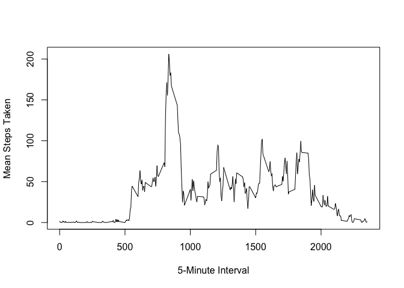
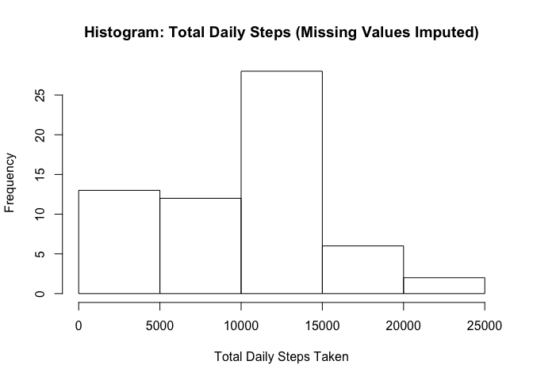
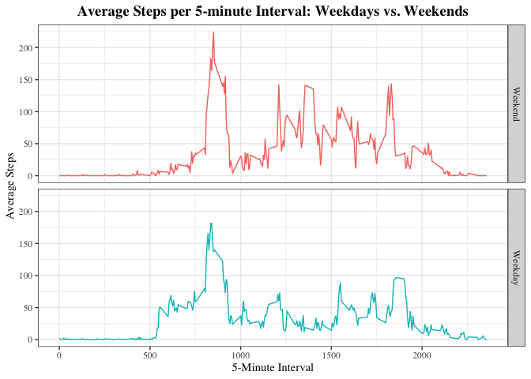

Author: Tara Grillos <br>
Date: April 10, 2020

# Activity Data

In this assignment, I will read in the Activity monitoring data, which includes 
information on the  number of steps taken in a 5-minute interval on each day 
during the months of October & November 2012 by an anonymous individual. 

I will analyze the mean, median and distribution of total daily steps taken, both
before and after imputing the missing values in the data, and I will display
differences in patterns across weekdays and weekends. 


## Loading and preprocessing the data

### 1. Code for reading in the dataset and processing the data


```r
library(lubridate)
library(dplyr)
```


```r
# download the data from the web
fileURL <- "https://d396qusza40orc.cloudfront.net/repdata%2Fdata%2Factivity.zip"
download.file(fileURL,destfile='data.zip')
unzip('data.zip')
# read the data into R
activity <- read.csv("activity.csv")
# use lubridate to make the date variable easier to work with
activity$date <- ymd(activity$date)
```

## What is mean total number of steps taken per day?

### 2. Histogram of the Total Number of Steps taken each day


```r
# calculate the total steps taken by date
stepsperday <- tapply(activity$steps,activity$date,sum,na.rm=TRUE)
# generate a histogram of the total daily steps
hist(stepsperday, xlab="Total Daily Steps Taken", main="Histogram: Total Daily Steps (Missing Values Dropped)")
```

<!-- -->

### 3. The mean daily steps taken is ~9,354, while the median daily steps taken is 10,395.


```r
# calculate the mean and median daily steps and print them in a recognizable way
paste(c("Mean:",mean(stepsperday,na.rm=TRUE))); paste(c("Median:",median(stepsperday,na.rm=TRUE)))
```

```
## [1] "Mean:"            "9354.22950819672"
```

```
## [1] "Median:" "10395"
```

## What is the average daily activity pattern?

### 4. Time Series Plot of the average number of steps taken


```r
# calculate the mean steps by 5-minute time interval
meansteps <- with(activity,tapply(steps,interval,mean,na.rm=TRUE))
# create a corresponding vector of the 5-minute intervals
mins <- unique(activity$interval)
# generate a time series plot showing the mean steps across minutes of the day
plot(mins, meansteps,type="l",ylab="Mean Steps Taken",xlab="5-Minute Interval") 
```

<!-- -->


### 5. The 5-minute interval that, on average, contains the maximum number of steps. 
It is from 8:35-8:40am. 


```r
index <- which(meansteps==max(meansteps))
mins[index]
```

```
## [1] 835
```

## Imputing missing values

### 6. Code to describe and show a strategy for imputing missing data
My strategy for imputation was to replace all missing values with the median 
value of steps taken during the 5-minute interval of the observation.


```r
#calculate the median steps for each interval 
activity$median <- tapply(activity$steps,activity$interval,median,na.rm=TRUE)
# generate a new variable that replaces all the missing steps data with median
activity <- mutate(activity, steps2=ifelse(is.na(activity$steps),median,steps))
# replace the original steps variable with the updated one
activity$steps <- activity$steps2
# remove the extraneous columns that are no longer needed from the dataset
activity <- activity[,-c(4,5)]
```


### 7. Histogram of the total number of steps taken each day after missing values are imputed.
Note that the median steps taken per interval is close to zero for many intervals.
For this reason, the two histograms do not look very different.


```r
# re-calculate the total steps taken by date
stepsperday2 <- tapply(activity$steps,activity$date,sum,na.rm=TRUE)
# generate a new histogram of the total daily steps taken
hist(stepsperday2, xlab="Total Daily Steps Taken", main="Histogram: Total Daily Steps (Missing Values Imputed)")
```

<!-- -->

## Are there differences in activity patterns between weekdays and weekends?

### 8. Panel plot comparing the average number of steps taken per 5-minute interval across weekdays and weekends


```r
# load ggplot2 for graphics
library(ggplot2)
# create a new factor variable labelling observations as weekdays or weekends
activity <- mutate(activity,weekend=(wday(date)==6|wday(date)==7)) 
activity$weekend <- factor(activity$weekend,levels=c(TRUE,FALSE),labels=c("Weekend","Weekday"))
# create a new dataset that groups by interval and weekend/weekday and finds mean steps taken
StepsByTime <- activity %>% group_by(interval, weekend) %>%
  summarise_each(mean, "steps")
# graph steps over minute intervals, grouped by weekday vs weekend
g <- ggplot(StepsByTime, aes(x=interval,y=steps,color=weekend))   
g + facet_grid(weekend~.) + geom_line() + theme_bw(base_family="Times") +
    ggtitle("Average Steps per 5-minute Interval: Weekdays vs. Weekends") + 
    labs(x="5-Minute Interval", y="Average Steps") + theme(legend.position = "none") +
    theme(plot.title = element_text(face="bold", size=14, hjust=0.5))
```

<!-- -->


